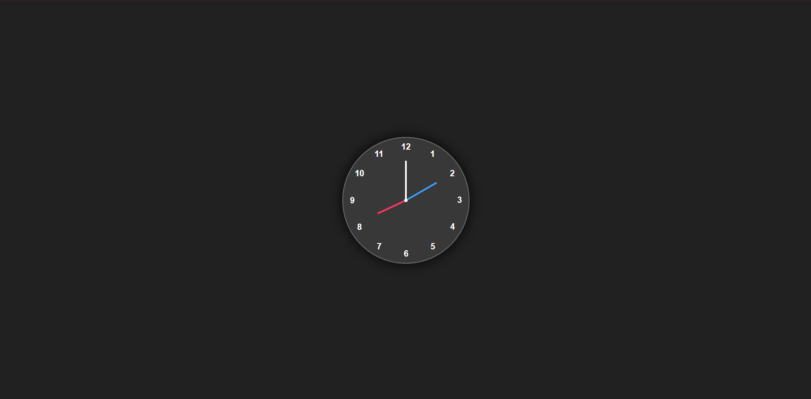

# 🕒 Analog Clock

A smooth and responsive **Analog Clock** built with **HTML**, **CSS**, and **JavaScript**. It visually represents the current time with animated hour, minute, and second hands—styled with modern aesthetics using CSS variables and transforms.

---

## 🚀 Features

- 🕰️ Real-time clock with accurate hand movement
- 💡 CSS-driven design using custom properties 
- 📱 Fully responsive layout
- 🎨 Clean UI with minimal glassmorphism-style look
- 💻 No libraries or frameworks required – pure vanilla JS

---

## 📂 Project Structure

```
analog-clock/
├── index.html        # HTML structure for the analog clock
├── style.css         # CSS styles for layout and design
├── script.js         # JavaScript for time logic and hand rotation
├── demo.png          # Screenshot of the running clock
└── README.md         # Project documentation
```

---

## 📸 Screenshot



---

## 🛠️ Technologies Used

- **HTML5** – Structure of the clock
- **CSS3** – Clock face styling, rotations, positioning
- **JavaScript (ES6)** – Real-time hand animation

---

## ▶️ How It Works

- The clock has 3 div elements for hour, minute, and second hands.
- CSS variables control hand color and length.
- JavaScript fetches the current time using the `Date` object.
- It calculates rotation angles and applies them to the hands every second using `setInterval`.


## 💬 Feedback

Feel free to open an issue or submit a PR for enhancements or bug fixes.

---

Enjoy the rhythm of time! ⏳
```

